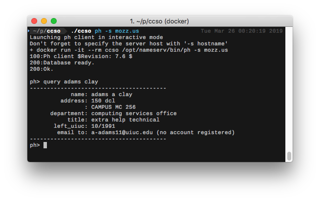
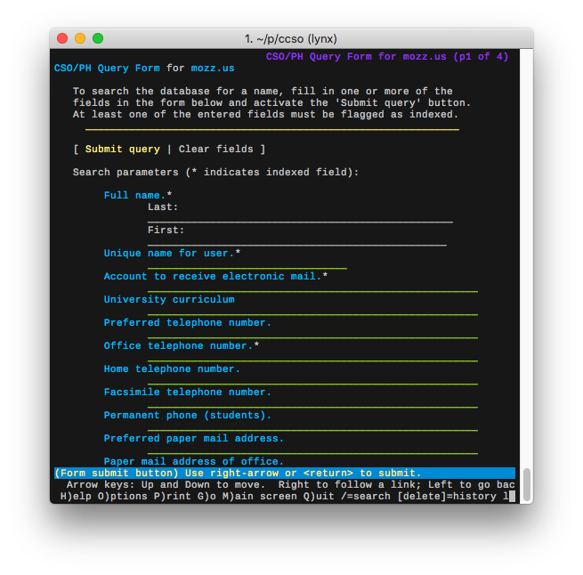
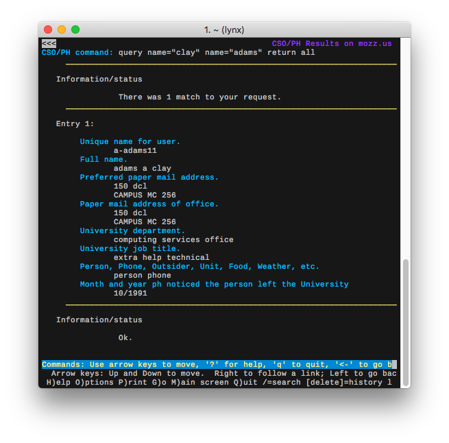
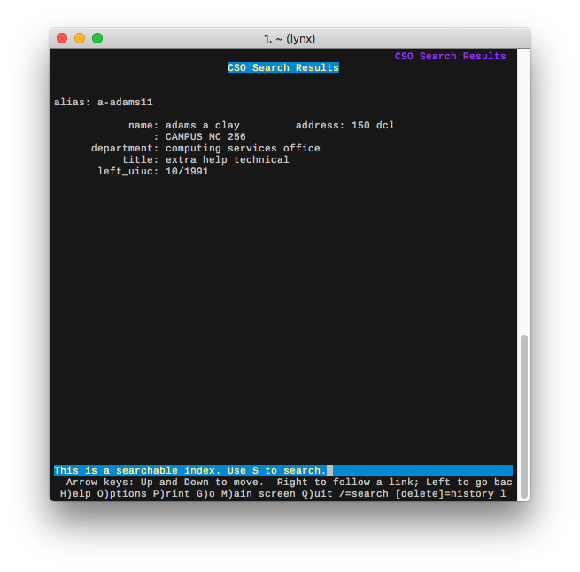
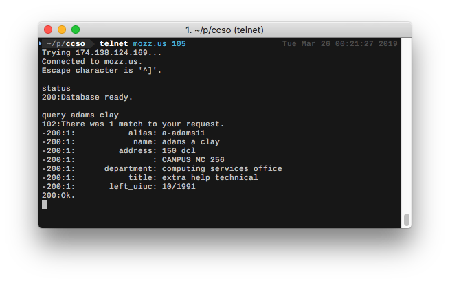
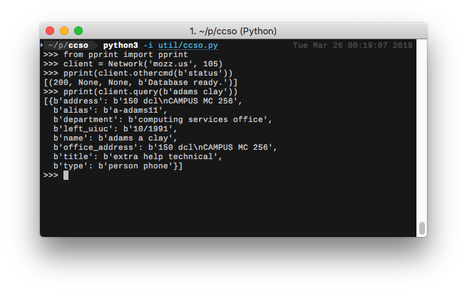

# CCSO Nameserver

<p align="center">

</p>

The CCSO nameserver was an early form of database search on the Internet. 
In its most common form, it was used as an electronic "Phone Book" to
lookup information such as telephone numbers and email addresses. Today,
this service has largely been replaced by LDAP.  [[1]](https://en.wikipedia.org/wiki/CCSO_Nameserver)

This repository contains a working version of the original CCSO nameserver
(aka *"Qi"*) developed by Steven Domer at University of Illinois in '93. I
salvaged the source code off a long forgotten FTP server, stuck it into a
*CentOS* Docker Container, and smashed it with a hammer until *gcc* cried
uncle and compiled without errors.

The fruits of this labor can be seen here:

**cso://mozz.us:105**

There are less than a handful of CCSO servers still running on the open web.
This is probably the first new nameserver to go live in over a decade! More
information about CCSO, including a list of active domains, can be found at:

<a href=gopher://mozz.us:70/1/ccso><b>gopher://mozz.us:70/1/ccso</b></a>
([http proxy](https://gopher.floodgap.com/gopher/gw?a=gopher%3A%2F%2Fmozz.us%3A70%2F1%2Fccso))

## Table of Contents

- [Quickstart](#quickstart)
- [Using this Repository](#using-this-repository)
- [CCSO Clients](#ccso-clients)
- [Interesting Documents](#interesting-documents)

## Quickstart

```bash
git clone https://github.com/michael-lazar/ccso-nameserver.git && cd ccso-nameserver
./ccso build
./ccso initdb
./ccso qi
```

*This will build the docker container, initialize a new CCSO database using the built-in seed data, and launch an interactive Qi command line prompt. The only dependency is [Docker](https://www.docker.com/).*

## Using this Repository

### Commands

I have included a [bash script](ccso) that contains aliases for my commonly used docker commands:

Command | Description
--- | ---
``./ccso build`` | Build the CCSO docker image
``./ccso initdb`` | Setup the CCSO database files inside of a persistant docker volume
``./ccso shell`` | Launch a shell into the docker container
``./ccso ph`` | Launch the ph client
``./ccso qi`` | Run the qi server in local "hero" mode
``./ccso daemon`` | Run the qi server in silent daemon mode
``./ccso install-service`` | Install a systemd service that exposes the qi server

### Running Qi as a Daemon

Qi was originally designed to run behind an [inetd](https://en.wikipedia.org/wiki/Inetd) service. The ``qi`` binary itself has very straightforward behavior: Read one or more commands from *stdin*, write its response to *stdout*, and exit. Inetd handles running the actual TCP server and managing the incoming socket connections.

Inetd is not very popular anymore and has been largely supplanted by other services. For my implementation, I decided to use [systemd sockets](https://www.freedesktop.org/software/systemd/man/systemd.socket.html) instead. Systemd binds to port 105 on the host machine, and everytime there's an incoming connection it launches an ephemeral docker container that executes the ``qi`` binary. The container runs for the duration of the connection and shuts down once the connection closes.

Here's what the systemd service looks like:

```ini
# /etc/systemd/system/ccso.socket
[Unit]
Description=CCSO Nameserver

[Socket]
ListenStream=105
Accept=yes

[Install]
WantedBy=sockets.target
```

```ini
# /etc/systemd/system/ccso@.service
[Unit]
Description=CCSO Service
Requires=ccso.socket

[Service]
Type=simple
# Assumes the repository was cloned into /var/ccso/
ExecStart=/var/ccso/ccso daemon
StandardInput=socket
StandardError=journal

[Install]
WantedBy=multi-user.target
```

### Customizing the Database

You can customize the fields in your CCSO database by editing the following files:

File | Description
--- | ---
[util/db/prod-new.cnf](util/db/prod-new.cnf) | Defines all of the fields and indices that will be available to the nameserver
[util/db/qi.input](util/db/qi.input) | Defines seed data that will be added when the database is created
[util/db/initdb](initdb) | Shell script used to construct the database files

See the [CSO Nameserver FAQ](https://mozz.us/static/ccso/FAQ.txt) for more information on how these files are structured.

You can re-initialize the database at any time with the following commands, but beware that it will overwrite any existing data saved in the CCSO server. Migrating data from an old format appears to be a painful process, and I have not yet attempted it.

```bash
./ccso build
./ccso initdb
```

### Explore!

There are a ton of tools for *qi* and *ph* that are bundled with the source code but that I haven't documented here. A great place to start is by launching a shell into the docker container and poking around the **/opt/nameserv/** directory.

## CCSO Clients

CCSO's simple, plaintext ASCII protocol lends itself to work with a wide
range of terminal clients. Some are more sophisticated than others.

### Ph

Ph (stands for *"Phonebook"*) was the original CCSO client that was developed
alongside the Qi server by University of Illinois. The source code is bundled
with Qi, and it gets built and installed inside of the docker image. I've included
a shortcut command to launch Ph from the docker container. Use the ``-s`` flag
to specify a server host. 

<p align="center">

</p>

### Lynx

Lynx (the curses web browser) supports CCSO links using the ``cso://`` protocol.
When you open a cso link, lynx will present you with a form that contains all of
the fields that are indexed and searchable by the CCSO server. Pretty neat!

**Example:** ``$ lynx cso://mozz.us``

<p align="center">


</p>

Lynx also recognizes gopher URLs with item type 2, and will parse everything
after the ``?`` as a CCSO query.

**Example:** ``$ lynx "gopher://mozz.us:105/2?name=adams clay"``

<p align="center">

</p>

### Telnet

Good ol' Telnet. Is there anything it can't do?

<p align="center">

</p>

### Python

This repo also includes a [python script](util/ccso.py) for automating connections to CCSO servers.
The script was borrowed from [https://github.com/jcollie/ccso](https://github.com/jcollie/ccso)
and has been ported to work with python 3.

<p align="center">

</p>

## Interesting Documents

A series of reference documents were published by the University of Illinois
between 1988 and 1992. These cover everything from the motivations for creating
the CCSO Nameserver, to a retrospective of what worked and what didn't.
These are a great place to start if you're looking for some historical context:

- [The CCSO Nameserver - A Description](https://mozz.us/static/ccso/description.pdf)
- [The CCSO Nameserver - Guide to Installation](https://mozz.us/static/ccso/install.pdf)
- [The CCSO Nameserver - Programmer's Guide](https://mozz.us/static/ccso/programmer.pdf)
- [The CCSO Nameserver - Why?](https://mozz.us/static/ccso/why.pdf)
- [The CCSO Nameserver - An Introduction](https://mozz.us/static/ccso/introduction.pdf)
- [The CCSO Nameserver - Server Client Protocol](https://mozz.us/static/ccso/protocol.pdf)

An RFC memo was later published in 1998 that formally describes the CCSO protocol:

- [RFC 2378](https://tools.ietf.org/html/rfc2378)

Man pages:

- [Ph User Manual](https://mozz.us/static/ccso/ph.0.pdf)
- [Qi User Manual](https://mozz.us/static/ccso/qi.0.pdf)

Other miscellaneous documentation:

- [A CCSO User Guide for the University of Illinois](https://mozz.us/static/ccso/ph.pdf) *(This one is very comprehensive!)*
- [CSO Nameserver FAQ](https://mozz.us/static/ccso/FAQ.txt)
- [Qi Installation Quick-Start](https://mozz.us/static/ccso/quick-start.txt)
- [Rebuilding a Nameserver Database in 24 Easy Steps](https://mozz.us/static/ccso/rebuild.pdf)
